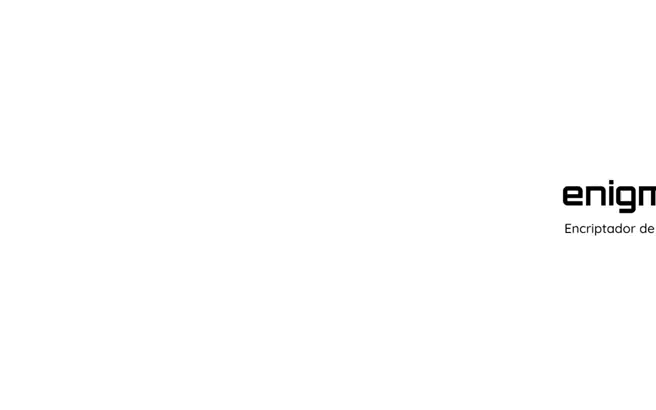
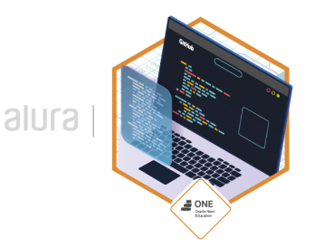

## Welcome to the enigmo text encryptor project repository!
---

[![Website][enigmo-label]][enigmo-url] [![license][license-label]][licencia-url] [![releases][releases-label]][releases-url] 
[![ONE][challenge-label]][challenge-url] [![ONE][one-label]][one-url] [![Alura][alura-label]][alura-url]  
[![LinkedIn][linkedin-shield]][linkedin-url] [![readme][leeme-shield]][leeme-url]

## What is the enigmo text encryptor?

Enigmo text encryptor is a web application that allows you to quickly and easily encrypt and decrypt text messages. It uses a vowel substitution algorithm with keywords that can only be reversed by the same application.

## How to use the text encryptor?

To use Enigmo, simply follow these steps:

- Go to the website at [enigmo | text encryptor](https://crisarhp.github.io/Enigmo_encriptador_de_texto-ONEG5/).
- Enter the text you want to transform in the designated box.
- Choose whether you want to encrypt or decrypt your text by clicking on the corresponding buttons.
- Copy your transformed text and use it as desired.

To use Enigmo locally, download all the files from this repository at [releases](https://github.com/crisarhp/Enigmo_encriptador_de_texto-ONEG5/releases) and open the **index.html** file with your web browser.

## What does encrypting or decrypting the text mean?

Encrypting the text means transforming it into a secret code that can only be read by someone who knows the key. In this case, the key is the Enigmo algorithm, which substitutes vowels with the following words:

- e = enter
- i = imes
- a = ai
- o = ober
- u = ufat

For example, the text _"Hey, this is enigmo"_ would be encrypted as _"hentery, thimess imess enternimesgmober"_.

Decrypting the text means performing the reverse process, that is, recovering the original text from the secret code. To do this, simply enter the text encrypted by Enigmo in the designated box and click on the decrypt button. For example, the text _"henterllober enterventerry obernenter"_ would be decrypted as _"hello every one"_.

## About this website

This project is part of the first challenge of the Oracle Next Education program and aims to apply the knowledge acquired during the Beginner in Programming training provided by Alura Latam.

This web application has been developed by Cristian Herrera.

## Contact

If you have any questions, suggestions, or comments about this project, you can contact Cristian through the following channels:

- Email: crisarhp@outlook.com
- LinkedIn: [cristianherrerap](https://www.linkedin.com/in/cristianherrerap/)

# Are you ready to start transforming your text?

Go to Enigmo and decrypt the following text: [![Website][enigmo1]][enigmo-url]

~~~
thaink yoberufat foberr ufatsimesng enternimesgmober, thenter tenterxt enterncryptoberr thait ailloberws yoberufat tober cobermmufatnimescaitenter sentercufatrenterly aind plaiyfufatlly. wenter hoberpenter yoberufat haiventer enternjoberyenterd ufatsimesng thimess aipplimescaitimesobern aind thait yoberufat shairenter imest wimesth yoberufatr frimesenternds. imesf yoberufat haiventer ainy sufatggenterstimesoberns, cobermmenternts, oberr qufatenterstimesoberns, plenteraisenter dobern't hentersimestaitenter tober coberntaict ufats. yoberufatr fenterenterdbaick imess venterry imesmpoberrtaint tober ufats. 
~~~

---

## Challenge 01 Completion Badge: Text Encryptor

Enigmo encriptador de texto © 2023 by Cristian Herrera is licensed under CC BY-NC-SA 4.0 

<!-- MARKDOWN LINKS & IMAGES -->
[releases-label]: https://img.shields.io/badge/see-Releases-blueviolet
[releases-url]: https://github.com/crisarhp/Enigmo_encriptador_de_texto-ONEG5/releases
[enigmo1]: https://img.shields.io/badge/ENIGMO-blueviolet
[enigmo-label]: https://img.shields.io/badge/website-ENIGMO-lightgrey
[enigmo-url]: https://crisarhp.github.io/Enigmo_encriptador_de_texto-ONEG5/
[challenge-label]:https://img.shields.io/badge/-%23ChallengeOnedecodificador5-F3E0FF
[challenge-url]:https://github.com/topics/challengeonecodificador5
[ONE-label]: https://img.shields.io/badge/Oracle_Next_Education-E0FDFF
[ONE-url]:https://www.oracle.com/mx/education/oracle-next-education/
[alura-label]: https://img.shields.io/badge/Alura_Latam-E0FDFF
[alura-url]: https://www.aluracursos.com/
[license-label]: https://img.shields.io/badge/license-CC%20BY--NC--SA%204.0-blue
[licencia-url]: license.md
[linkedin-shield]: https://img.shields.io/badge/-LinkedIn-black.svg?style=for-the-badge&logo=linkedin&colorB=0A66C2
[linkedin-url]: https://www.linkedin.com/in/cristianherrerap/
[leeme-shield]: https://img.shields.io/badge/ES-Leer%20en%20espa%C3%B1ol-success
[leeme-url]: README_es.md