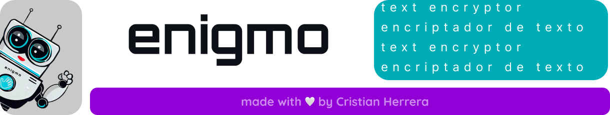
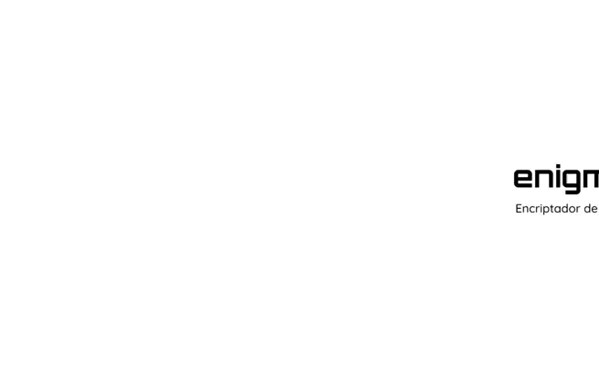
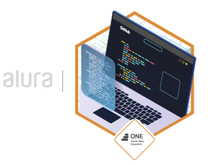

## ¡Bienvenidos al repositorio del proyecto enigmo encriptador de texto!
---

[![Website][enigmo-label]][enigmo-url] [![licencia][licencia-label]][licencia-url] [![releases][releases-label]][releases-url] 
[![ONE][challenge-label]][challenge-url] [![ONE][one-label]][one-url] [![Alura][alura-label]][alura-url]  
[![LinkedIn][linkedin-shield]][linkedin-url] [![readme][leeme-shield]][leeme-url]

## ¿Qué es enigmo encriptador de texto?

Enigmo encriptador de texto es una aplicación web que te permite encriptar y desencriptar mensajes de texto de forma rápida y sencilla. Usa un algoritmo de sustitución de vocales por otras palabras clave, que solo puede ser revertido por la misma aplicación.  

## ¿Cómo se usa el encriptador de texto?

Para usar Enigmo, solo tienes que seguir estos pasos:

- Ingresa a su sitio web en [enigmo | encriptador de texto](https://crisarhp.github.io/Enigmo_encriptador_de_texto-ONEG5/).
- Ingresa el texto que deseas transformar en la casilla indicada.
- Elige si quieres encriptar o desencriptar tu texto, haciendo clic en los botones correspondientes.
- Copia tu texto transformado y úsalo como quieras.   

Para usar enigmo de manera local descarga todos los archivos de este repositorio en [releases](https://github.com/crisarhp/Enigmo_encriptador_de_texto-ONEG5/releases)  y abre el archivo **index.html** con el navegador.

## ¿Qué significa encriptar o desencriptar el texto?

Encriptar el texto significa transformarlo en un código secreto, que solo puede ser leído por quien conozca la clave. En este caso, la clave es el algoritmo de Enigmo, que sustituye las vocales por las siguientes palabras:

- e = enter
- i = imes
- a = ai
- o = ober
- u = ufat

Por ejemplo, el texto _"Hola, este es enigmo"_ se encriptaría como _"hoberlai, enterstenter enters enternimesgmober"_.

Desencriptar el texto significa hacer el proceso inverso, es decir, recuperar el texto original a partir del código secreto. Para ello, solo tienes que ingresar el texto encriptado por Enigmo en la casilla y hacer clic en el botón de desencriptar. Por ejemplo, el texto _"ufatn sailufatdober ai toberdobers"_ se desencriptaría como _"Un saludo a todos"_.

## Sobre este sitio web

Este proyecto es parte del primer desafío del programa Oracle Next Education, y tiene como objetivo poner en práctica los conocimientos adquiridos durante la formación de Principiante en Programación, impartida por Alura Latam.

Esta aplicación web ha sido desarrollada por Cristian Herrera

## Contacto

Si tienes alguna duda, sugerencia o comentario sobre este proyecto, puedes contactarte por los siguientes medios:

- Email: crisarhp@outlook.com
- LinkedIn: [cristianherrerap](https://www.linkedin.com/in/cristianherrerap/)

# ¿Estás listo para empezar transformar tu texto?

Ve a enigmo y desencripta el siguiente texto: [![Website][enigmo1]][enigmo-url]

~~~
graicimesais poberr ufatsair enternimesgmober, enterl enterncrimesptaidoberr denter tenterxtober qufatenter tenter penterrmimestenter cobermufatnimescairtenter denter foberrmai sentergufatrai y dimesventerrtimesdai. enterspenterraimobers qufatenter haiyais dimessfrufattaidober denter enterstai aiplimescaicimesón y qufatenter lai cobermpairtais cobern tufats aimimesgobers. simes timesenternenters ailgufatnai sufatgenterrenterncimesai, cobermenterntairimesober ober prentergufatntai, nober dufatdenters entern coberntaictairnobers. tufat oberpimesnimesón enters mufaty imesmpoberrtaintenter pairai nobersobertrobers. 
~~~

---

## Insignia de finizalización de Challenge 01: Encriptador de texo

Enigmo encriptador de texto © 2023 by Cristian Herrera is licensed under CC BY-NC-SA 4.0 

<!-- MARKDOWN LINKS & IMAGES -->
[releases-label]: https://img.shields.io/badge/ver-Releases-blueviolet
[releases-url]: https://github.com/crisarhp/Enigmo_encriptador_de_texto-ONEG5/releases
[enigmo1]: https://img.shields.io/badge/ENIGMO-blueviolet
[enigmo-label]: https://img.shields.io/badge/website-ENIGMO-lightgrey
[enigmo-url]: https://crisarhp.github.io/Enigmo_encriptador_de_texto-ONEG5/
[challenge-label]:https://img.shields.io/badge/-%23ChallengeOnedecodificador5-F3E0FF
[challenge-url]:https://github.com/topics/challengeonecodificador5
[ONE-label]: https://img.shields.io/badge/Oracle_Next_Education-E0FDFF
[ONE-url]:https://www.oracle.com/mx/education/oracle-next-education/
[alura-label]: https://img.shields.io/badge/Alura_Latam-E0FDFF
[alura-url]: https://www.aluracursos.com/
[licencia-label]: https://img.shields.io/badge/licencia-CC%20BY--NC--SA%204.0-blue
[licencia-url]: licencia.md
[linkedin-shield]: https://img.shields.io/badge/-LinkedIn-black.svg?style=for-the-badge&logo=linkedin&colorB=0A66C2
[linkedin-url]: https://www.linkedin.com/in/cristianherrerap/
[leeme-shield]: https://img.shields.io/badge/EN-Read_in_English-success
[leeme-url]: README.md
